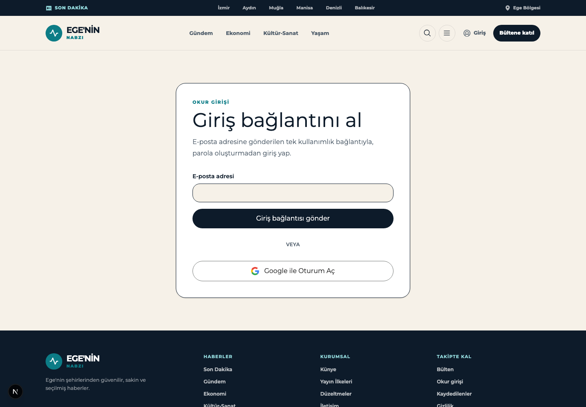
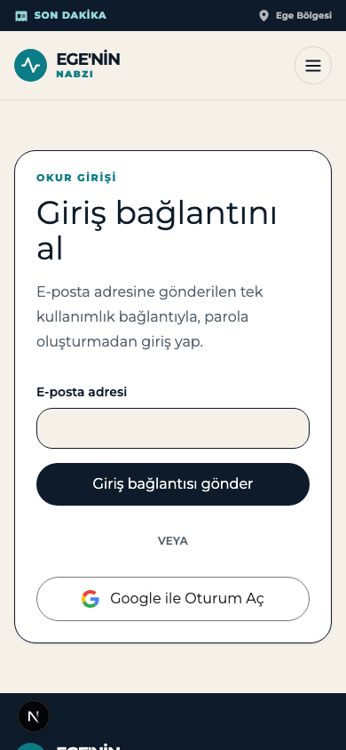
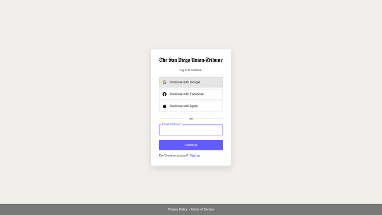
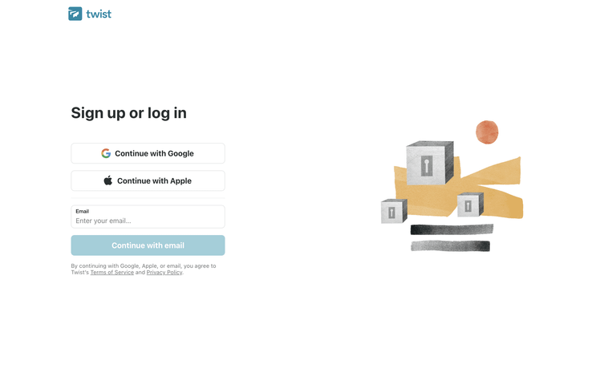
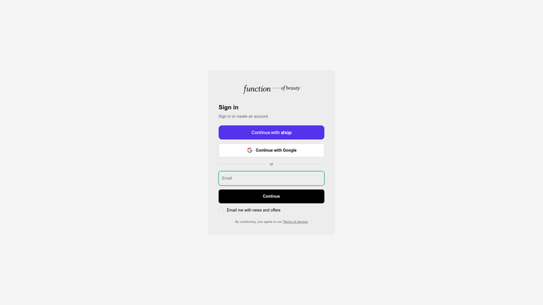
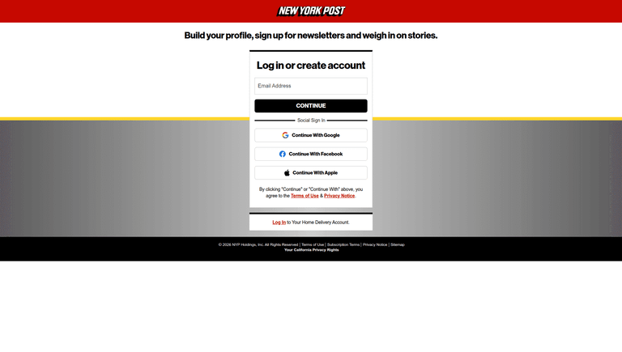
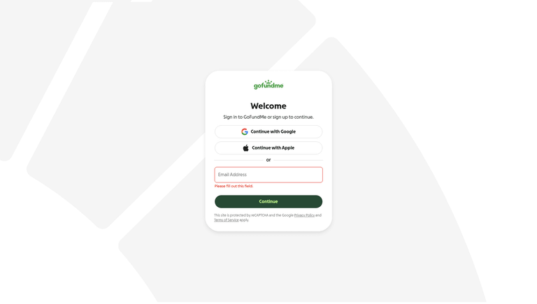
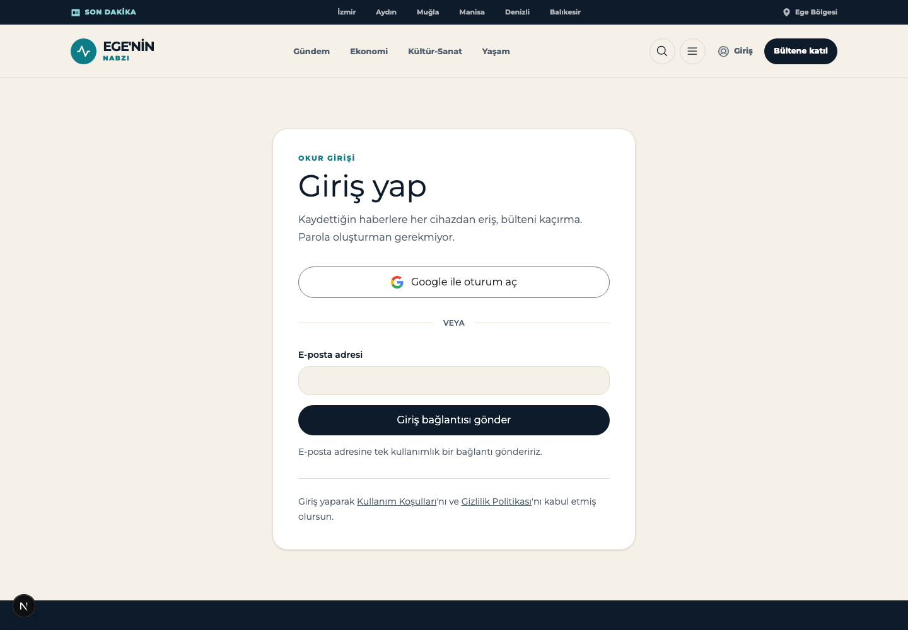
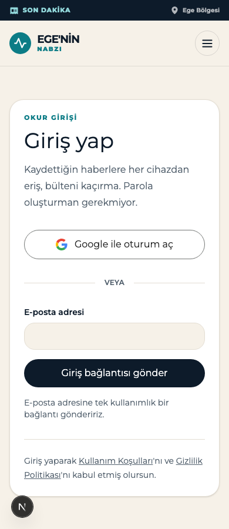

# Design Improvement: Giriş sayfası (/giris) — Google ile giriş

## TL;DR

Google girişi çalışıyor ama sayfada **ikinci sınıf bir seçenek** gibi duruyor: başlık hâlâ yalnızca
magic-link'i anlatıyor ("Giriş bağlantını al"), Google düğmesi formun altına itilmiş ve "VEYA"
ayracının çizgileri **hiç görünmüyor** — çünkü `--color-line` değişkeni projede hiçbir yerde
tanımlı değil. İncelediğim beş referansın dördü Google'ı e-posta formunun **üstüne** koyuyor ve
hepsi düğmelerin altında bir yasal onay satırı taşıyor; bizde o satır hiç yok.

---

## Current State


*`/giris` — 1440×1000. Kart içinde: eyebrow, başlık, açıklama, e-posta formu, "VEYA" ayracı, Google düğmesi.*


*390×844. Aynı sıralama; "VEYA" metni ayraç çizgileri olmadan boşlukta duruyor.*

---

## Improvement Ideas

### 1. Google'ı formun üstüne al, başlığı yöntemden bağımsız yap ⭐ (en yüksek etki)

Başlık **"Giriş bağlantını al"** sayfada tek bir giriş yöntemi varken doğruydu. Artık iki yöntem
var ve başlık bunlardan yalnızca birini tarif ediyor — Google ile girmek isteyen okur, doğru
sayfada olduğundan emin olamıyor. Aynı şekilde açıklama metni de yalnızca magic-link mekaniğini
anlatıyor.

Referansların dördü şu sırayı kullanıyor: **yöntemden bağımsız başlık → Google → ayraç → e-posta**.
Google tek tıkla bitiyor, magic-link ise "yaz → gönder → e-postana git → bağlantıya tıkla → geri
dön" adımlarını gerektiriyor. Hızlı yolu üste koymak standart hâline gelmiş durumda.

**Inspired by:**


*The San Diego Union-Tribune — haber sitesi girişi: "Log in to continue." başlığı, üstte Continue with
Google / Facebook / Apple, "OR" ayracı, altta e-posta + Continue, en altta Privacy Policy · Terms of
Service. [Lazyweb]*


*Twist — "Sign up or log in" başlığı, Continue with Google ve Continue with Apple üstte, altında
e-posta alanı ve "Continue with email", en altta yasal onay satırı. [Lazyweb]*


*Function of Beauty — "Sign in / Sign in or create an account", üstte sosyal düğmeler, "or" ayracı,
altta Email + Continue, en altta "By continuing, you agree to our Terms of service". [Lazyweb]*

**Why this works:** Başlık artık her iki yöntemi de kapsıyor, hızlı yol önce geliyor ve e-posta
formu hâlâ tam olarak eskisi kadar erişilebilir — kimseden bir şey alınmıyor, yalnızca sıra
değişiyor.

**Dürüst not — bu evrensel değil:** New York Post tam tersini yapıyor, e-postayı üstte tutup sosyal
girişi "Social Sign In" ayracının altına koyuyor. Yani sıralama bir tercih; ama başlığın yöntemden
bağımsız olması ve yasal satır (fikir 3) her iki düzende de geçerli.

**Sketch:**

```
┌───────────────────────────────────────┐
│  OKUR GİRİŞİ                          │
│  Giriş yap                            │   ← yöntemden bağımsız
│  Kaydettiğin haberlere ve bültene      │
│  eriş.                                 │
│                                        │
│  ┌──────────────────────────────────┐ │
│  │  G   Google ile oturum aç        │ │   ← üste taşındı
│  └──────────────────────────────────┘ │
│                                        │
│  ─────────────  veya  ─────────────   │   ← çizgiler artık görünüyor
│                                        │
│  E-posta adresi                        │
│  ┌──────────────────────────────────┐ │
│  └──────────────────────────────────┘ │
│  ┌──────────────────────────────────┐ │
│  │    Giriş bağlantısı gönder       │ │
│  └──────────────────────────────────┘ │
│                                        │
│  Devam ederek Kullanım Şartları ve     │   ← fikir 3
│  Gizlilik Politikası'nı kabul edersin. │
└───────────────────────────────────────┘
```

---

### 2. `--color-line` tanımlı değil — ayraç çizgileri görünmüyor, kenarlıklar mürekkep siyahı 🔴

Bu bir tasarım tercihi değil, doğrulanmış bir hata. Tarayıcıda ölçtüm:

| Ölçüm | Beklenen | Gerçek |
|---|---|---|
| `--color-line` token değeri | `#e5e0d8` benzeri yumuşak bir çizgi | `""` (tanımsız) |
| Ayraç çizgisi `background-color` | yumuşak gri | `rgba(0, 0, 0, 0)` — **tamamen şeffaf** |
| Kart kenarlığı `border-color` | yumuşak gri | `rgb(13, 27, 42)` — `--color-ink`, tam mürekkep |
| Input kenarlığı `border-color` | yumuşak gri | `rgb(13, 27, 42)` — tam mürekkep |

Sebep: `globals.css` içinde `--color-paper`, `--color-ink`, `--color-teal`, `--color-ochre` tanımlı
ama **`--color-line` hiç tanımlanmamış**. `background-color: var(--color-line)` geçersiz kalıyor ve
şeffafa düşüyor; `border-color` ise `currentColor`'a düşüp metnin mürekkep rengini alıyor.

Bu tek satırlık eksik yalnızca giriş sayfasını değil, **projede 29 kullanım yerini** etkiliyor
(`grep -rn "var(--color-line)"` → 29 sonuç, `--color-line:` → 0 sonuç). Yani yönetim paneli
kartları, bülten sayfası, arşiv listeleri hepsi aynı şeyden etkileniyor.

**Düzeltme:** `globals.css` içindeki `:root` bloğuna bir satır:

```css
--color-line: #e3ddd2;   /* --color-paper (#f6f1e8) ile uyumlu yumuşak çizgi */
```

**Why this works:** Referansların hepsinde ayraç, iki yöntemi görsel olarak ayıran gerçek bir
çizgi — Union-Tribune'de "OR", Function of Beauty'de "or", bizde ise havada asılı duran bir "VEYA".
Çizgi olmadan ayraç işini yapmıyor.

---

### 3. Düğmelerin altına yasal onay satırı ekle (KVKK)

İncelediğim beş referansın **beşi de** kimlik doğrulama düğmelerinin hemen altında bir onay satırı
taşıyor. Bizde hiç yok — ne şartlar, ne gizlilik, ne KVKK aydınlatma metni.

**Inspired by:**


*New York Post — düğmelerin altında: "By clicking 'Continue' or 'Continue With' above, you agree to
the Terms of Use & Privacy Notice." Ayrıca üstte neden giriş yapılacağını anlatan bir başlık var
(bkz. fikir 4). [Lazyweb]*


*GoFundMe — Google/Apple üstte, e-posta altta; en altta reCAPTCHA ve gizlilik/şartlar bildirimi,
ayrıca satır içi doğrulama hata mesajı. [Lazyweb]*

**Why this works:** Türkiye'de yayın yapan bir haber sitesi için KVKK aydınlatma yükümlülüğü var ve
Google girişi artık okurun ad-soyad ile e-posta adresini üçüncü bir tarafa taşıyor. Onay satırı bunu
karşılıyor ve zaten var olan `/gizlilik` sayfasına bağlanıyor.

**Sketch:**

```
  ┌──────────────────────────────────┐
  │    Giriş bağlantısı gönder       │
  └──────────────────────────────────┘

  Devam ederek Kullanım Şartları'nı ve
  Gizlilik Politikası'nı kabul etmiş olursun.
      └──── /kullanim-sartlari   └──── /gizlilik
```

---

### 4. Neden giriş yapılacağını söyle

Mevcut açıklama yalnızca *nasıl* girileceğini anlatıyor ("tek kullanımlık bağlantıyla, parola
oluşturmadan"). *Neden* girileceğini söylemiyor — okur giriş yaptığında ne kazanıyor?

New York Post kartın üstünde tam olarak bunu yapıyor: **"Build your profile, sign up for newsletters
and weigh in on stories."** Bizde karşılığı hazır: kaydedilen haberler (`/kaydedilenler` sayfası ve
`bookmarks` tablosu zaten var) ve bülten.

**Öneri:** açıklamayı "Kaydettiğin haberlere her cihazdan eriş, bültene abone ol." gibi bir faydaya
çevir; parolasız giriş detayını e-posta düğmesinin yanında ikincil bir nota indir.

**Why this works:** Giriş sayfası bir maliyet ekranı; okura ne aldığını söylemek dönüşümü artırır.
Ayrıca bizim durumumuzda giriş çoğu zaman bir haberi kaydetme niyetinden geliyor (`pendingBookmark`
akışı bunu zaten taşıyor) — o niyeti sayfada görünür kılmak tutarlı olur.

---

### 5. Her iki düğmeye de bekleme durumu ver

Google düğmesi bir server action tetikliyor, sonra Google'a tam sayfa yönlendirme yapıyor. Ağ yavaşsa
arada hiçbir geri bildirim yok — okur düğmeye ikinci kez basıyor. Aynı şey magic-link için de
geçerli.

`useFormStatus` ile `pending` durumunda düğmeyi `disabled` yapıp metnini değiştirmek yeterli
("Yönlendiriliyor…" / "Gönderiliyor…"). Bu, referanslarda ekran görüntüsünden okunamayan bir
davranış — o yüzden görsel referans yerine yalnızca gerekçeyi veriyorum: çift gönderim, magic-link
tarafında iki ayrı e-posta demek.

---

## Google marka uyumu (küçük düzeltmeler)

Google'ın resmî [branding guidelines](https://developers.google.com/identity/branding-guidelines)
sayfasından doğruladım:

| Kural | Bizim durum |
|---|---|
| Onaylı metinler: "Sign in with Google", "Sign up with Google", "Continue with Google" | ✅ "Google ile oturum aç" karşılığı doğru |
| Logo: standart renkli "G", beyaz zemin üzerinde | ✅ Dört renkli SVG, `bg-white` |
| Logodan sonra 10px, metinden sonra 12px sağ boşluk (web) | ⚠️ `gap-3` = 12px — yakın, kabul edilebilir |
| Düğme yüksekliği | ✅ 48px ölçüldü (min 40px'in üzerinde) |
| Yazı: Google Sans Medium 14/20 | ⚠️ Montserrat `font-semibold` 16px — site tipografisiyle tutarlı, kabul edilebilir sapma |
| Büyük/küçük harf | ⚠️ "Google ile **O**turum **A**ç" başlık kalıbında; Türkçe cümle kalıbı "Google ile oturum aç" |

Tek gerçek düzeltme sonuncusu: metni **"Google ile oturum aç"** yap.

---

## What's Working

Bunlara dokunmaya gerek yok:

1. **OAuth akışının kendisi doğru kurulmuş.** `signInWithOAuth` + `skipBrowserRedirect` varsayılanı,
   ayrı `/auth/callback` rotası ve `exchangeCodeForSession` ile PKCE takası — Supabase'in önerdiği
   yapı birebir bu.
2. **`next` parametresi her iki yöntemde de korunuyor.** Hem magic-link formunda gizli input olarak,
   hem Google akışında `authRedirectCookie` üzerinden. Kullanıcı nereden geldiyse oraya dönüyor.
3. **`pendingBookmark` akışı Google'a da bağlanmış.** Callback rotası bekleyen kaydı alıp
   `savePendingBookmark` ile işliyor ve `?bilgi=kaydedildi` ile geri dönüyor — magic-link ile aynı
   davranış. Bu tür detaylar genelde ikinci yöntem eklenirken unutulur, burada unutulmamış.
4. **Google SVG'si inline ve `aria-hidden`.** Ağ isteği yok, ekran okuyucu için gürültü yok, düğme
   metni erişilebilir etiketi zaten taşıyor.
5. **Hata durumları tek yerden yönetiliyor.** `loginNotice` ile `google_failed`, `not_configured` ve
   `sent` aynı bildirim bileşeninden geçiyor, `role="alert"` / `role="status"` doğru ayrılmış.

---

## All References

| # | Kaynak | Ne gösteriyor | Provenance |
|---|---|---|---|
| 1 | The San Diego Union-Tribune | Haber sitesi girişi; Google/Facebook/Apple üstte, "OR", e-posta altta, footer'da Privacy · Terms | [Lazyweb] |
| 2 | New York Post | Haber sitesi girişi; değer önerisi başlığı, e-posta üstte, "Social Sign In" altta, yasal onay satırı | [Lazyweb] |
| 3 | AP News | Haber sitesi modal girişi; "Login or register to continue", e-posta + Facebook/Google | [Lazyweb] |
| 4 | Twist | Google/Apple üstte, e-posta ve "Continue with email" altta, yasal onay satırı | [Lazyweb] |
| 5 | Function of Beauty | Sosyal düğmeler üstte, "or" ayracı, Email + Continue, "By continuing…" satırı | [Lazyweb] |
| 6 | GoFundMe | Google/Apple üstte, e-posta altta, satır içi doğrulama + reCAPTCHA/gizlilik bildirimi | [Lazyweb] |
| 7 | Attio | Google düğmesi + e-posta + Continue; sade beyaz düzen | [Lazyweb] |
| 8 | Linear | Continue with Google, e-posta, SAML SSO ve passkey — çoklu yöntem düzeni | [Lazyweb] |
| 9 | VEED | Google/Apple/Microsoft veya e-posta; şartlar-gizlilik bağlantıları ve reCAPTCHA notu | [Lazyweb] |
| 10 | Grammarly | Google/Facebook/Apple/SSO + e-posta; reCAPTCHA ve yasal bağlantılar | [Lazyweb] |
| 11 | Google Identity branding guidelines | Onaylı düğme metinleri, logo ve boşluk kuralları | [Web] |

Referans görselleri `references/` klasöründe.

---

## Uygulandı — Sonuç

Beş fikrin beşi de uygulandı.


*`/giris` sonrası — 1440×1000.*


*390×900.*

### Değişen dosyalar

| Dosya | Değişiklik |
|---|---|
| `src/app/globals.css` | `--color-line: #e3ddd2` tanımlandı (fikir 2) |
| `src/components/site/submit-button.tsx` | **yeni** — `useFormStatus` ile bekleme durumu (fikir 5) |
| `src/app/(site)/giris/page.tsx` | Başlık, sıralama, ayraç, rıza satırı, düğme metni (fikir 1, 3, 4) |

### Doğrulama

| Kontrol | Önce | Sonra |
|---|---|---|
| `--color-line` token | `""` | `#e3ddd2` |
| Ayraç çizgisi `background-color` | `rgba(0, 0, 0, 0)` | `rgb(227, 221, 210)` |
| Kart kenarlığı `border-color` | `rgb(13, 27, 42)` (ink) | `rgb(227, 221, 210)` |
| Google düğmesi bekleme durumu | yok | metin `Google'a yönlendiriliyorsun…`, `disabled=true`, `aria-busy=true` |
| Form sıralaması | e-posta → Google | Google → e-posta |
| `tsc --noEmit` | — | temiz |
| `eslint` (değişen dosyalar) | — | temiz |
| `vitest run` | — | 18 dosya / 99 test geçti |

Ayraç ve kenarlık değerleri tarayıcıda `getComputedStyle` ile, bekleme durumu ise sunucu eylemi
POST'u asılı bırakılarak gerçek sayfada ölçüldü.

### Açık kalan konu — rıza satırının bağlantıları 404 veriyor

Rıza satırı `/kullanim-kosullari` ve `/gizlilik` adreslerine bağlanıyor; bunlar footer'ın zaten
kullandığı adresler. Ancak bu dalda **o sayfalar mevcut değil** — ikisi de 404 dönüyor
(`/kunye` ve `/cerezler` ile birlikte; footer bu dalda yedi kurumsal bağlantının tamamı için 404
veriyor). Bu, bu görevden önce de var olan bir eksik; bağlantıları footer ile tutarlı bıraktım ki
sayfalar geldiğinde giriş sayfasında ek bir iş kalmasın. Sayfaların bu dala taşınması ayrı bir iş.
