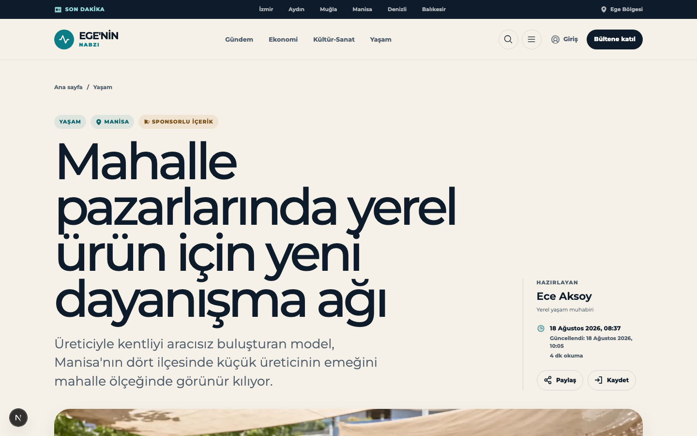
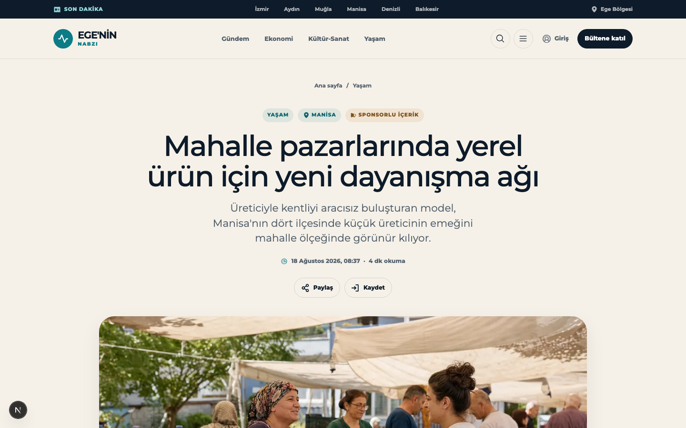
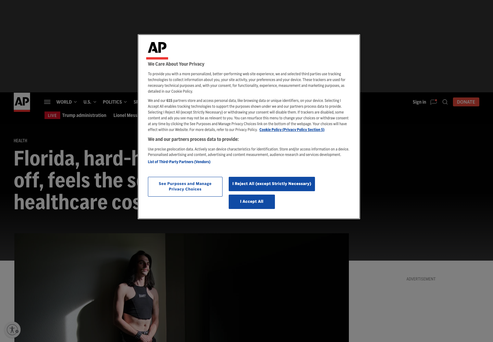
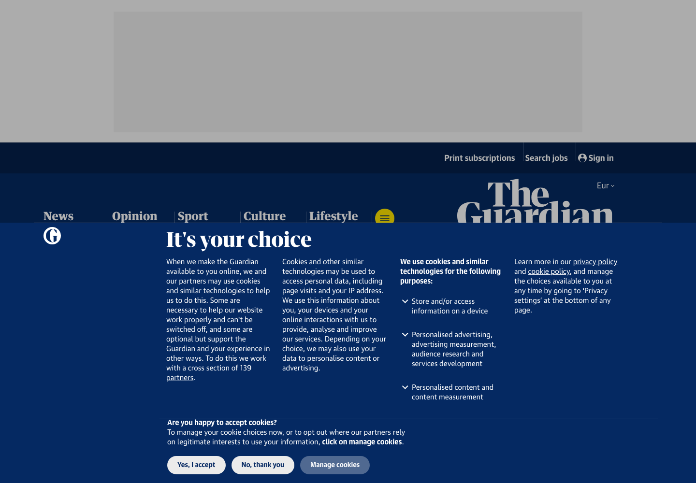
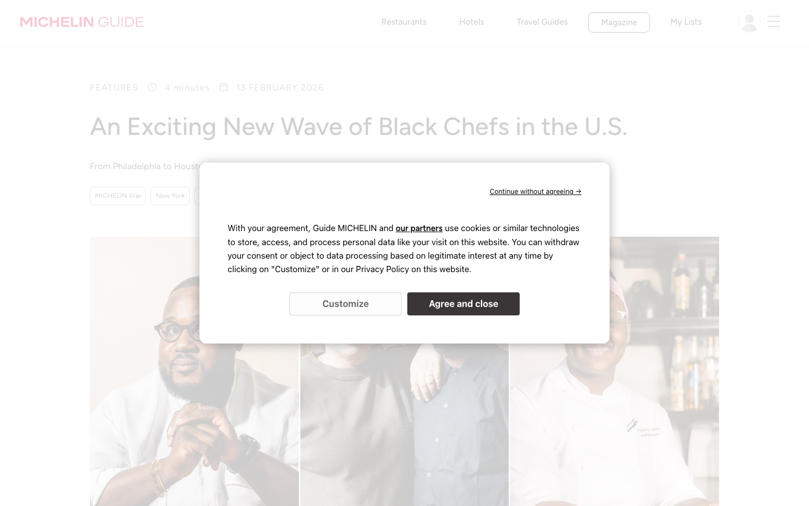
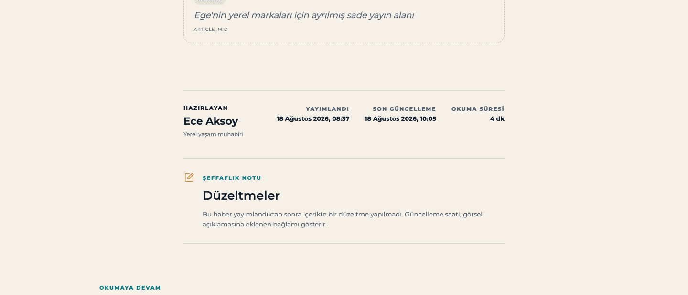

# Design Improvement: Haber Detay Sayfası (`/haber/[slug]`)

**Date:** 2026-09-01 · **Screen:** `/haber/mahalle-pazarlarinda-yerel-urun` · **Status:** implemented

## TL;DR

The headline was set at **105px** on a 1440px viewport — roughly **1.75× AP News** and **3× The
Guardian**, the two extremes of mainstream news practice. It consumed the entire first fold on
its own. Everything below had been scaled up to keep pace with it, to the point where the
"İlgili hikâyeler" section heading (72px) was *larger than the article's own headline*. Bringing
the H1 to 60px and rebalancing the cascade beneath it recovers **253px of the fold** and cuts
total page height by **9%**, without giving up the brand's bold display voice.

## Current State


*Before — 1440×900. The headline occupies the fold entirely: 105px, 4 lines, 380px tall. The
hero photo begins at y≈840, fully below the fold. Note the tight `line-height: 0.9` crowding the
descenders on **ğ** and **ş** in "dayanışma ağı".*


*After — same viewport. Headline 60px / 2 lines / 127px, centered on the hero's axis, with the
full byline moved to the article footer. The photo now enters the fold.*

## Evidence: what news sites actually do

Measured with Playwright at 1440px viewport, reading computed styles off live article pages on
2026-09-01:

| Site | H1 size | line-height | lines | Body text | Reading column | Hero ratio |
|---|---|---|---|---|---|---|
| AP News | 60px | 64px (1.07) | 3 | 18px | 720px | 1.50 |
| Michelin Guide | 44px | 52.8px (1.20) | 1 | 15px | 630px | — |
| The Guardian | 34px | 39.1px (1.15) | 3 | 17px | 620px | 1.25 |
| The Atlantic | — | — | — | 18px | — | 1.50 |
| Vox | — | — | — | — | — | 1.33 |
| **Ege'nin Nabzı (before)** | **105px** | **94px (0.90)** | **4** | 21px | 672px | **1.60** |
| **Ege'nin Nabzı (after)** | **60px** | **63.6px (1.06)** | **2** | 21px | 672px | 1.60 |

Two patterns hold across every reference:

1. **No mainstream outlet exceeds ~60px** for an article H1 at desktop width. 105px is a
   magazine *cover* size applied to an article page.
2. **The hero is never more than ~1.36× the width of the text column.** AP runs 977px hero over
   a 720px column. The Guardian runs them flush at 620px each. Ege'nin Nabzı was running a
   1216px hero over a 672px column — a **1.81×** mismatch, which is why the photo read as
   detached from the story.

## Improvement Ideas

### 1. Bring the headline to 60px and loosen the leading ⭐ (highest impact)

`clamp(3.2rem, 7.3vw, 6.8rem)` → `clamp(2.4rem, 4.3vw, 3.75rem)`, `line-height: 0.9` → `1.06`,
`letter-spacing: -0.065em` → `-0.03em`, and `max-width: 13ch` → `24ch`.

The `13ch` cap was the hidden culprit: it forced the title to break every ~13 characters
regardless of available width, producing 4 lines out of a headline that comfortably fits 2.

**Inspired by:**

*AP News — 60px / 700 weight / `line-height: 1.07`, headline over a 980px column with the photo
directly beneath. The single largest headline among the mainstream outlets measured, which makes
it the right ceiling for a brand with a bold display voice. [Web]*

**Why this works:** matching AP's ceiling rather than the Guardian's floor keeps the site's
assertive character. The leading change matters more than it looks in Turkish specifically —
`0.9` clips the descenders on **ğ**, **ş** and **ç**, and "dayanışma ağı" hits two of the three.

```
BEFORE                          AFTER
┌────────────────────────┐      ┌────────────────────────┐
│ ‹ nav ›                │      │ ‹ nav ›                │
│ Ana sayfa / Yaşam      │      │ Ana sayfa / Yaşam      │
│ [YAŞAM][MANİSA][SPON]  │      │ [YAŞAM][MANİSA][SPON]  │
│                        │      │                        │
│ Mahalle       ┌──────┐ │      │ Mahalle pazarlarında   │
│ pazarlarında  │ Ece  │ │      │ yerel ürün için yeni   │
│ yerel ürün    │Aksoy │ │      │ dayanışma ağı  ┌─────┐ │
│ için yeni     │ tarih│ │      │                │ Ece │ │
│ dayanışma ağı │ ⧉ ⧉  │ │      │ Üreticiyle...  │Aksoy│ │
│                        │      │ ...görünür     │ ⧉ ⧉ │ │
│ Üreticiyle kentliyi    │      │ kılıyor.       └─────┘ │
│ aracısız buluşturan…   │      │ ┌────────────────────┐ │
├─ ─ ─ fold ─ ─ ─ ─ ─ ─ ┤      │ │  hero photo        │ │
│ ┌────────────────────┐ │      ├─│─ ─ ─ fold ─ ─ ─ ─ ─┤ │
└─│  hero photo (840↓) │─┘      └─└────────────────────┘─┘
```

### 2. Narrow the hero to 64rem so it reads as part of the story

`.hero { width: min(100% - 4rem, 64rem); margin-inline: auto; }` — 1216×760 → **1024×640**, a
**29% area reduction**, with the native `1586 / 992` aspect ratio kept so nothing is cropped.

**Inspired by:**

*The Guardian — hero photo set flush to the 620px text column, so the image and the prose read as
one object. [Web]*


*Michelin Guide — long-form editorial with a constrained hero over a 630px reading measure.
[Lazyweb — `guide.michelin.com`, category Food & Drink, similarity 0.63]*

**Why this works:** the hero stays wider than the text (the standard editorial "modest bleed",
as AP does) without overwhelming it. Idea 4 then pulls the header and body onto the same 64rem
bounds, so the photo, the headline and the prose all share one frame:

```
   ┌────────────────────────────────────┐
   │      headline · deck (centred)     │  64rem  (header)
   ├──────┌──────────────────────┐──────┤
   │      │   hero  1024 × 640   │      │  64rem  ← narrowed
   │      └──────────────────────┘      │
   │ Dosya    ┌──────────────┐          │
   │          │  body 672px  │          │  centred on the same axis
   └──────────└──────────────┘──────────┘
```

### 3. Restore the hierarchy below the headline

Once the H1 drops, everything scaled to match the old one is visibly wrong. The section heading
was the worst offender — at 72px it outranked the article's own title.

| Element | Before | After |
|---|---|---|
| Deck / `.summary` | 26px | 22px |
| Body `h2` | 50px | 30px |
| Pull-quote | 34px | 26px |
| "İlgili hikâyeler" `h2` | **72px** | 42px |
| Related story `h3` | 40px | 26px |
| "Düzeltmeler" `h2` | 32px | 26px |
| Drop cap | 60px | 47px |

Body paragraphs (21px / `line-height: 1.78` over a 42rem measure) were left untouched — they
already sit right above AP's 18px and read well.

**Why this works:** the reader can now tell the article title from a section label at a glance,
which is the whole job of a type scale.

### 4. Centre the header on the hero's axis and move the byline to the footer

The header was a two-column grid — headline left, byline rail right — sitting in a 76rem shell
while the hero sat in 64rem and the body column sat off-centre by 104px. Four different axes on
one page.

Now every block shares **one centre line** and the header shares the hero's exact 64rem bounds:

| Block | Left edge | Width | Centre |
|---|---|---|---|
| Header (`h1` / deck) | — | 24ch / 36rem | **720** |
| Hero | 208 | 1024 | **720** |
| Body column | 384 | 672 | **720** |
| Side note | 208 | 144 | — (aligned to the hero's left edge) |
| Byline footer | 384 | 672 | **720** |
| Correction | 384 | 672 | **720** |
| Related | 208 | 1024 | **720** |

The reading layout changed from `10rem 42rem` (which pushed the body right of centre) to
`minmax(0,1fr) 42rem minmax(0,1fr)`, so the body is centred by construction at any width and the
"Dosya" side note floats in the left gutter, right-aligned against the text.

**The byline moved to the article footer:**


*Author, role, published date, last-updated timestamp and reading time as a two-column footer at
the reading measure, directly above the transparency note. [Local capture]*

A slim `18 Ağustos 2026, 08:37 · 4 dk okuma` line stays under the deck — news convention is that
a reader can judge a story's freshness before committing to it, and the full künye at the bottom
does not serve that. Share/save also stayed at the top; a single `ArticleActions` instance keeps
the optimistic bookmark state in one place.

```
┌──────────────────────────────────────┐
│           Ana sayfa / Yaşam          │
│     [YAŞAM] [MANİSA] [SPONSORLU]     │
│      Mahalle pazarlarında yerel      │  ← centred, 24ch
│      ürün için yeni dayanışma ağı    │
│    Üreticiyle kentliyi aracısız…     │  ← centred, 36rem
│      🕐 18 Ağustos 2026 · 4 dk       │  ← slim freshness line
│         [Paylaş]  [Kaydet]           │
│  ┌────────────────────────────────┐  │
│  │        hero 1024 × 640         │  │  ← same 64rem bounds
│  └────────────────────────────────┘  │
│  Dosya │  body 672px, centred        │
│        │                             │
│        ├─────────────────────────┐   │
│        │ HAZIRLAYAN   YAYIMLANDI │   │  ← künye, article footer
│        │ Ece Aksoy    SON GÜNCEL.│   │
│        ├─────────────────────────┤   │
│        │ Düzeltmeler             │   │
└────────┴─────────────────────────┴───┘
```

## What's Working

Four things were already right and were deliberately left alone:

1. **Source order.** Breadcrumb → labels → headline → deck → byline → hero → body matches AP,
   The Guardian, ProPublica and CNN exactly. No reordering was needed.
2. **The reading measure.** 42rem (~65ch) at 21px is textbook — wider than The Guardian's 620px
   and narrower than AP's 720px, right in the sweet spot.
3. **The byline content.** Author, role, timestamp, "Güncellendi" and reading time is the right
   field set — more complete than AP's inline byline. It moved from a header rail to the article
   footer (idea 4), but nothing was dropped.
4. **The label row and figcaption.** Category / location / sponsored disclosure as pills, plus a
   caption-and-credit pair under the photo, is proper news hygiene. `NewsArticle` JSON-LD is
   already emitted with the right fields.

## Verified Results

Measured on the running dev server after implementation:

| Metric | Before | After | Δ |
|---|---|---|---|
| H1 font size (1440px) | 105px | 60px | −43% |
| H1 line count | 4 | 2 | −2 |
| H1 block height | 380px | 127px | **−253px** |
| Hero dimensions | 1216 × 760 | 1024 × 640 | −29% area |
| Hero top offset | ~840px | 564px | −276px |
| Total page height | 4930px | 4469px | −9% |
| H1 font size (390px) | 58px | 32px | −45% |
| Distinct horizontal axes | 4 (76 / 64 / 57+offset) | **1** | — |
| Mobile horizontal overflow | none | none | — |

`e2e/article.spec.ts` — 7 passed, 1 skipped (the mobile-only projection skip).

## Open Item

`public/images/mahalle-pazari-dayanisma.png` is a **2.4 MB PNG** served with `priority` on this
page. Converting it to WebP/AVIF is the largest remaining performance win here and is unrelated
to sizing — worth a separate pass.

## All References

| Reference | Source | What it shows |
|---|---|---|
| `references/apnews-article.png` | [Web] apnews.com | 60px H1, 1.07 leading, 977px hero over a 720px column — the ceiling for mainstream article headlines |
| `references/guardian-article.png` | [Web] theguardian.com | 34px H1, hero flush to the 620px text column |
| `references/michelin-article.png` | [Lazyweb] guide.michelin.com | Long-form editorial, 44px H1, constrained hero over a 630px measure |
| `references/current.png` | Local capture | Before, desktop 1440×900 |
| `references/current-mobile.png` | Local capture | Before, mobile 390px full page |
| `references/after.png` | Local capture | After, desktop 1440×900 |
| `references/after-mobile.png` | Local capture | After, mobile 390px |

Lazyweb searches run: `news article detail page headline hero image` (desktop, 25 results) and
`editorial longform article typography reading column` (desktop, 12 results). Article-detail
matches surfaced: ProPublica, CBC, The Hindu, CNN, Politico, Boston Globe, Niantic, Michelin
Guide. Live measurement was used in preference to the screenshot database for the type-scale
numbers, since computed styles are exact where a screenshot is not.
