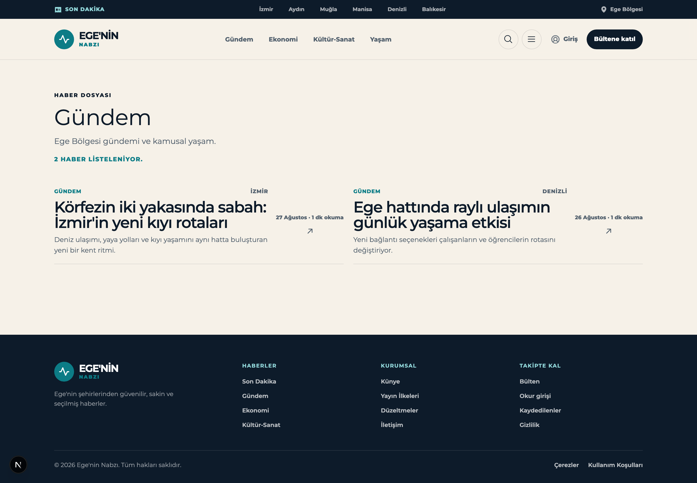
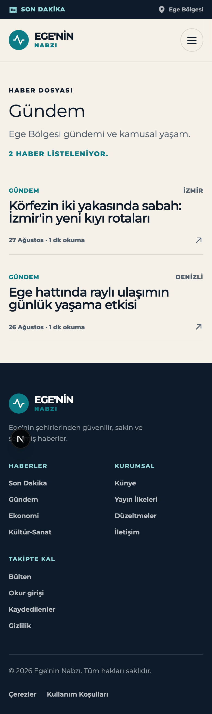
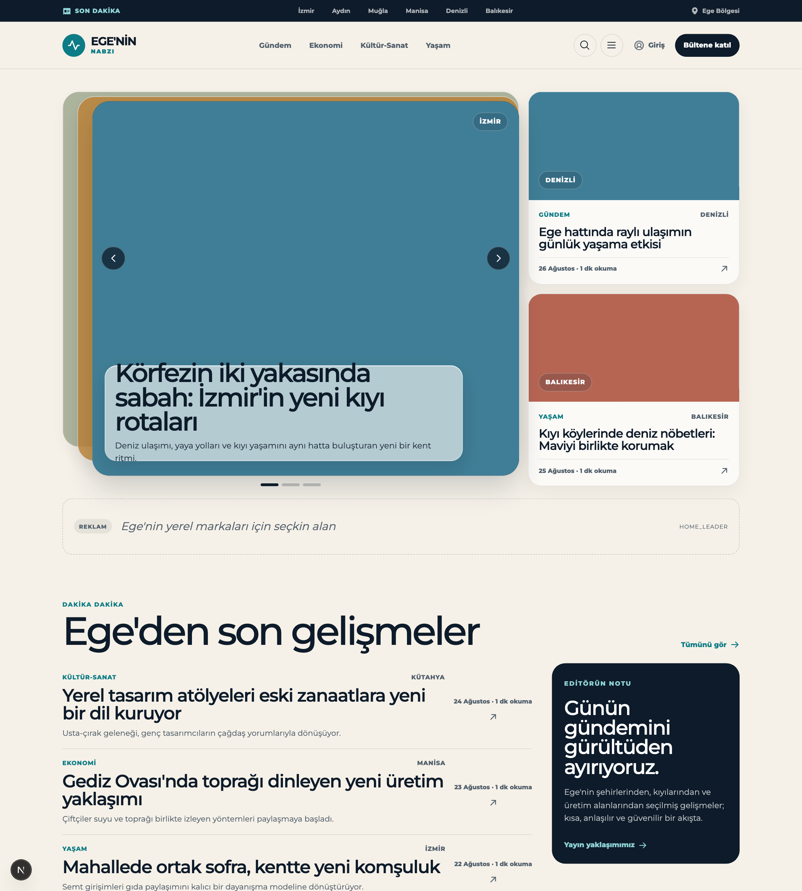
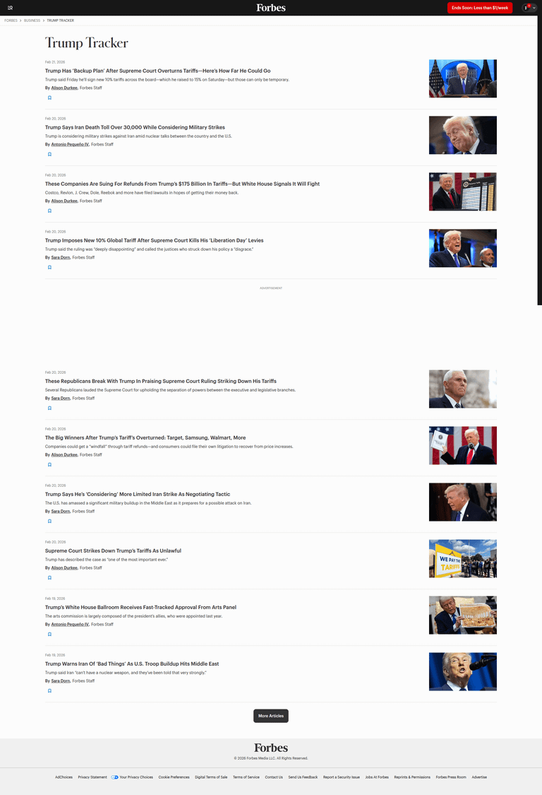
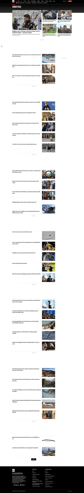
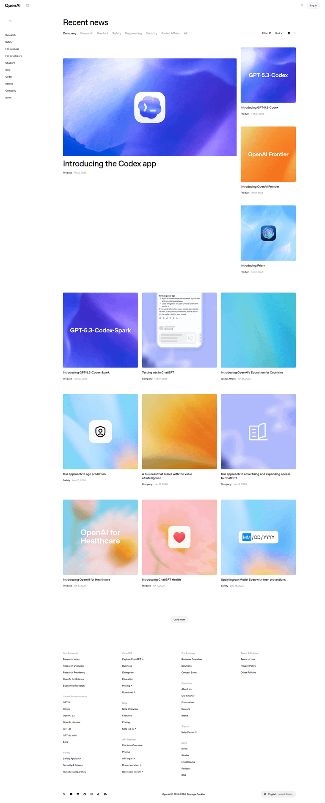
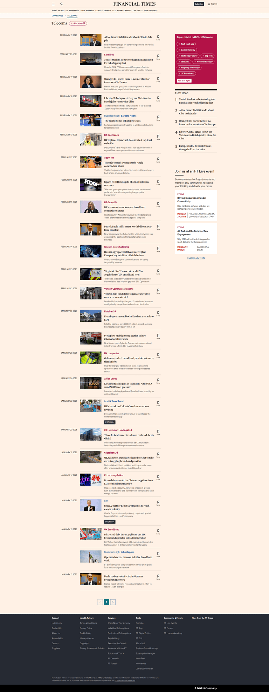

# Design Improvement: Kategori Detay Sayfası (`/kategori/[slug]`)

## TL;DR

The category page is the only surface on the site that renders **zero imagery** — `ArticleCard variant="timeline"` gates `MediaSurface` behind `variant !== "timeline"`, so a page that should look like a section front looks like a bare text dump. Give it a lead story, thumbnail rows, and a wayfinding rail, and the "AI slop" reading disappears.

## Current State



*`/kategori/gundem` at 1440px. Eyebrow → oversized title → lede → teal all-caps count, then a 2-up grid of text-only rows, then ~500px of dead space above the footer.*



*390px. Note that the mobile card is actually the better one — the summary is dropped and the date sits on its own baseline instead of in a floating right column.*

For contrast, the homepage this page is supposed to belong to:



*Stacked-deck carousel, `MediaSurface` colour blocks with location pills, ad slot, huge section headings, an ink editor's-note panel. The category page inherits none of it.*

## Improvement Ideas

### 1. Put a picture on every row ⭐ (highest impact)

The single reason this page reads as generated: there is no media. Not one block of colour. Every other card variant in the codebase (`feature`, `secondary`, `topic`) calls `MediaSurface`; `timeline` alone skips it, and `timeline` is what the category page uses.

This costs nothing in content terms — `MediaSurface` already falls back to a solid tone block with the location as a pill when an article has no hero photo, and that fallback is what the homepage actually ships today. The colour is already computed per article (`mediaTone`).

**Inspired by:**



*Forbes — `forbes.com/trump/`. A pure chronological topic feed: date, headline, one-line summary and byline on the left, thumbnail hard-right, thin rule between rows. No hero, no grid — and it still reads as a designed page purely because every row carries an image. [Lazyweb]*

**Why this works:** a thumbnail column gives every row a fixed left or right edge, which is exactly what the current 2-up text grid lacks. It also converts the page's biggest liability (lots of vertical space, few articles) into rhythm.

**Sketch:**

```
┌──────────────────────────────────────────────────┐
│ GÜNDEM                                    İZMİR  │
│ ┌────────┐  Körfezin iki yakasında sabah:        │
│ │ ▓▓▓▓▓▓ │  İzmir'in yeni kıyı rotaları          │
│ │ İZMİR  │  Deniz ulaşımı, yaya yolları ve kıyı  │
│ └────────┘  yaşamını aynı hatta buluşturan…      │
│             27 Ağustos · 1 dk okuma           ↗  │
├──────────────────────────────────────────────────┤
│ ┌────────┐  Ege hattında raylı ulaşımın          │
│ │ ▓▓▓▓▓▓ │  günlük yaşama etkisi                 │
└──────────────────────────────────────────────────┘
```

### 2. Lead with one story instead of six equal ones ⭐

Every entry currently carries identical weight. No newspaper section front does this — the section front *is* the editorial judgement about which story leads.

Render `entries[0]` as `variant="feature"` (full-width media, `clamp(2rem, 4vw, 3.4rem)` headline — the variant already exists and is used on the homepage) and the remainder as thumbnail rows. On page 2 and beyond, drop the lead entirely: a hero on page 4 of an archive is noise, not hierarchy.

**Inspired by:**



*AP — `apnews.com/oddities`. A featured lead with a large photo and a right-side grid of top stories, then a long feed of headline + thumbnail rows below. The lead is doing all the hierarchy work; everything under it is deliberately uniform. [Lazyweb]*



*OpenAI — `openai.com/news/company-announcements/`. Same shape in a much quieter visual register: category tabs, one large hero card, then a uniform grid. Closer to this site's restraint than AP is. [Lazyweb]*

**Sketch:**

```
┌───────────────────────────────────────┐
│ ▓▓▓▓▓▓▓▓▓▓▓▓ LEAD MEDIA ▓▓▓▓▓▓▓▓▓▓▓▓ │
│ ▓▓▓▓▓▓▓▓▓▓▓▓▓▓▓▓▓▓▓▓▓▓▓ [İZMİR] ▓▓▓▓ │
├───────────────────────────────────────┤
│ GÜNDEM                          İZMİR │
│ Körfezin iki yakasında sabah          │  ← 3.4rem
│ Deniz ulaşımı, yaya yolları ve…       │
│ 27 Ağustos · 1 dk okuma            ↗  │
└───────────────────────────────────────┘
   ── then uniform thumbnail rows ──
```

### 3. Add a rail so the page has somewhere to go

Today the page is a cul-de-sac: no breadcrumb UI (breadcrumbs exist in JSON-LD only), no sibling topics, no cities, no CTA. A reader who finishes Gündem has one option — the browser back button. The rail also solves the dead-space problem structurally: with 2 articles the page currently bottoms out into an empty band.

Panels: sibling topics and cities as chips (the `.chips` pill pattern already exists in `arama.module.css`), a "Dosya hakkında" panel carrying the category description in the `.readingAside` style from the article detail page, and the existing `<NewsletterForm />`.

**Inspired by:**



*FT — `ft.com/telecoms`. The rail is literally a "Topics related to FT/Tech/Telecoms" chip panel, then "Most Read", then an events promo. Note also the breadcrumb (`COMPANIES › TELECOMS`) and how modest the section title is — FT spends its hierarchy on the feed, not the masthead. [Lazyweb]*

**Sketch:**

```
Ana sayfa / Gündem
┌ HABER DOSYASI ─────────────────────────────────┐
│ Gündem                          12 haber · 2 sy│
│ Ege Bölgesi gündemi ve kamusal yaşam.          │
│ ▔▔▔▔▔▔  ← tone accent                          │
└────────────────────────────────────────────────┘
┌ content ───────────────────┐ ┌ rail ──────────┐
│ ▓▓▓▓ LEAD ▓▓▓▓             │ │ DİĞER DOSYALAR │
│ Körfezin iki yakasında…    │ │ (Ekonomi)(Yaşam)│
│ ───────────────────────    │ │ ŞEHİRLER        │
│ ┌──┐ Ege hattında raylı…   │ │ (İzmir)(Aydın)  │
│ └──┘ 26 Ağustos         ↗  │ │ ─────────────   │
│ ┌──┐ …                     │ │ DOSYA HAKKINDA  │
│ └──┘                       │ │ Ege Bölgesi…    │
│      [‹] [1] [2] [›]       │ │ ─────────────   │
│                            │ │ Bültene katıl   │
└────────────────────────────┘ └────────────────┘
```

### 4. Fix the card footer — it is a layout bug, not a style choice

`.articleCardtimeline .articleFooter` is `grid-column: 2; grid-row: 1 / span 3; align-self: center`. That parks "27 Ağustos · 1 dk okuma" plus an arrow in a narrow right column, vertically centred against a two-line headline. In the 2-up grid it produces four ragged text columns across the page — the most visibly machine-assembled thing on the screen.

The fix already exists in the file: the `<700px` media query collapses the footer back to a single full-width row. Promote that to the default. This also lifts `/son-dakika`, `/yazar/[slug]` and `/arama`, which share the variant.

```
BEFORE                              AFTER
┌────────────────────────────┐      ┌────────────────────────────┐
│ GÜNDEM              İZMİR  │      │ GÜNDEM              İZMİR  │
│ Körfezin iki       27 Ağus │      │ Körfezin iki yakasında     │
│ yakasında sabah    1 dk  ↗ │  →   │ sabah: İzmir'in yeni…      │
│ Deniz ulaşımı…             │      │ Deniz ulaşımı, yaya…       │
└────────────────────────────┘      │ 27 Ağustos · 1 dk okuma  ↗ │
   ↑ ragged 2-col text             └────────────────────────────┘
```

### 5. Stop the count from shouting, and give each category a colour

`2 HABER LİSTELENİYOR.` in uppercase teal reads as debug output. Move it to a quiet `--color-ink-muted` meta line in sentence case: `2 haber · 1 sayfa`.

Then give the masthead a short accent rule in the category's own tone. `tonesByTopic` already exists in `article-preview.ts` (gündem → sky, ekonomi → sage, kültür-sanat → ochre, yaşam → coral) but every city falls through to teal. Extend it to the seven seeded cities. No migration needed — `topics` and `locations` have no colour column, and this value is editorially fixed anyway.

## What's Working

Genuinely good things that should survive the redesign:

1. **The type system.** Montserrat at weight 520–560 with `-0.03em` to `-0.055em` tracking and `lh 0.92–1.1` is a real, distinctive voice — the squeezed display look is the site's signature. The category page under-uses it (`clamp(2rem, 4.4vw, 2.85rem)` where the homepage's `SectionHeading` goes to `4.4rem`), but the treatment itself is right.
2. **The palette.** Paper `#f6f1e8` / ink `#0d1b2a` / teal `#0c7c86` / ochre `#c98c3a` is warm, specific, and unmistakably not a default. Keep it exactly.
3. **The pager.** Server-rendered plain links, elided with a 9-item cap and a window of 2 either side, no JS, crawlable. `buildPagerItems` is well-reasoned code and needs no changes.
4. **`MediaSurface`'s fallback.** Degrading to a tone block with a location pill rather than a broken-image hole is the right call, and it is why idea #1 costs nothing.
5. **Accessibility discipline.** `role="status"` on the count, `role="alert"` on the error panel, `aria-hidden` on every decorative Phosphor icon, a global `3px` ochre focus ring, and `prefers-reduced-motion` honoured throughout.

## All References

| Company | Screen | Source | What it shows |
|---|---|---|---|
| Forbes | `forbes.com/trump/` | [Lazyweb] | Chronological topic feed; headline + summary + byline left, thumbnail right, "More Articles" pager |
| AP | `apnews.com/oddities` | [Lazyweb] | Featured lead + top-story grid, then an infinite feed of headline/thumbnail rows |
| FT | `ft.com/telecoms` | [Lazyweb] | Feed with thumbnails and save icons; rail with related-topic chips, Most Read, events promo |
| OpenAI | `openai.com/news/company-announcements/` | [Lazyweb] | Category tabs + filter/sort, one hero card, then a uniform image-forward grid |
| NPR | `npr.org/sections/art-design` | [Lazyweb] | Section landing: vertical feed of headlines with thumbnails, summaries and metadata |
| Fox News | `foxnews.com/category/science/planet-earth` | [Lazyweb] | Category listing: vertical feed with thumbnails, topic tags, timestamps, short summaries |
| People | `people.com/real-people` | [Lazyweb] | Category listing as a masonry grid of story cards with thumbnails and headlines |

Not used as an idea anchor, kept for context: NPR, Fox News and People are all further confirmation that a category listing without imagery is not a pattern anyone ships.
